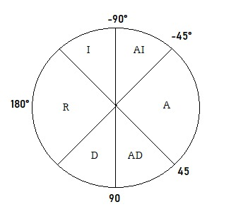

# Fuzzy-Navigation for a Vehicle
The development of the strategy of Obstacle avoidance navigation for a Pioneer robot using fuzzy logic in Coppelia and 
Python. For this The data was acquired from the simulator and processed in Python by using the API provided by it simulator.

This repository have with an report in the folder Programas_Informe_Y_Escenario/Informe/

### Examples and logic
Firts scene

Fuzzy logic

Set

Motor velocities

